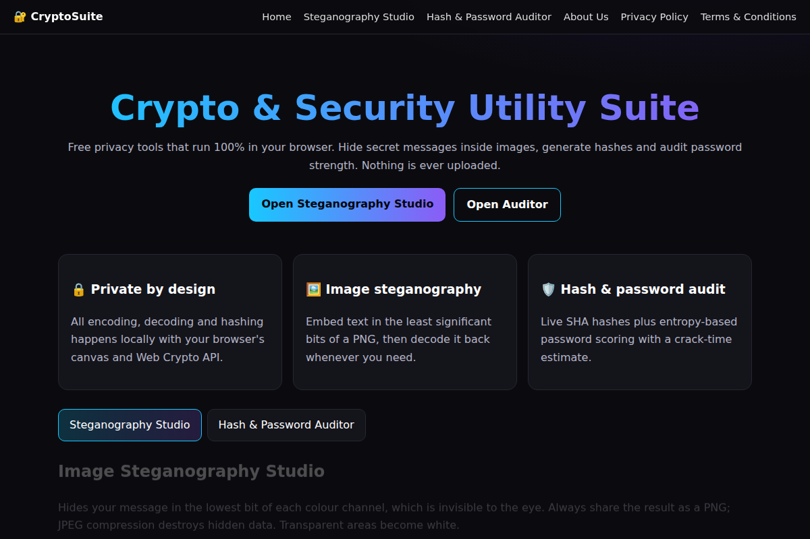
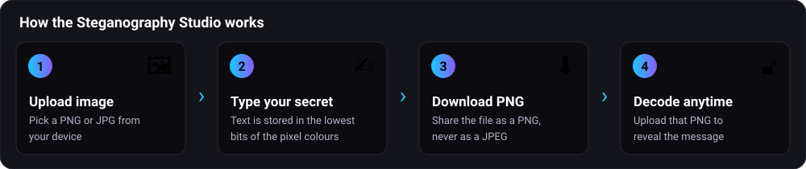
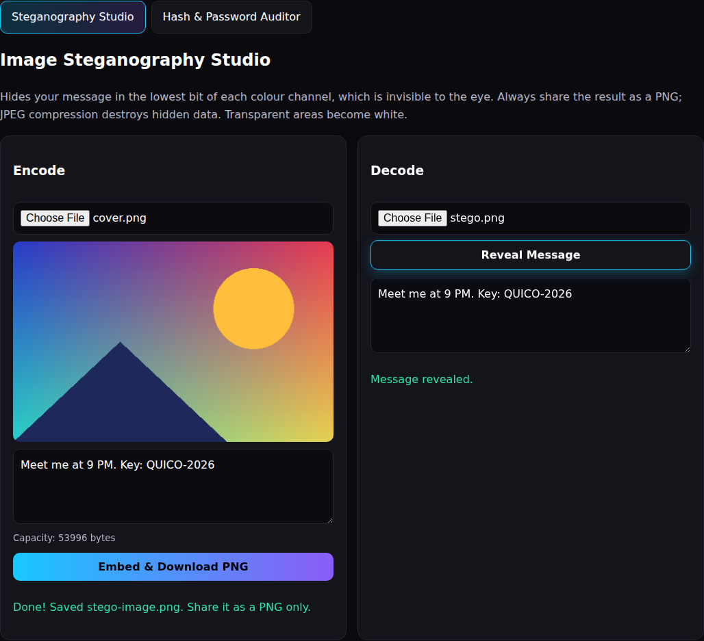
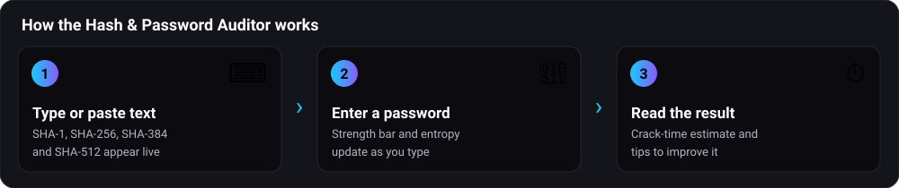
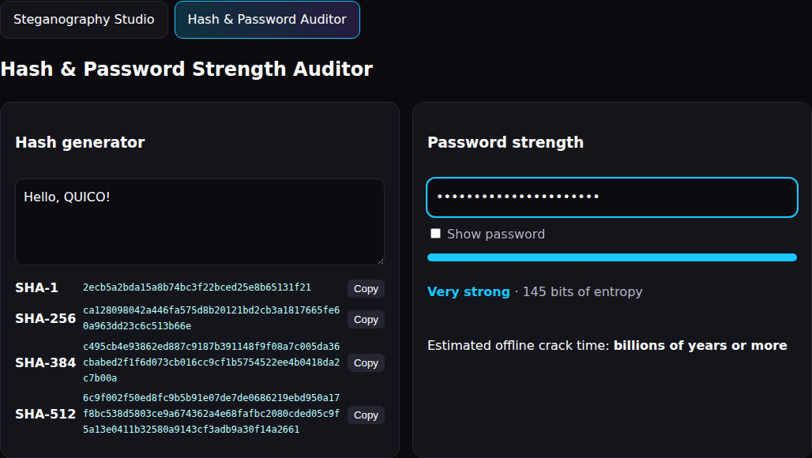

# Crypto & Security Utility Suite

A dark-themed, static, privacy-first web app. Everything runs locally in the browser; nothing is uploaded.

## Features
- **Steganography Studio**: hide and reveal UTF-8 text inside PNG images using RGB least-significant-bit encoding (canvas API).
- **Hash generator**: live SHA-1, SHA-256, SHA-384 and SHA-512 via the Web Crypto API, with copy buttons.
- **Password auditor**: entropy-based score, pattern penalties, tips and offline crack-time estimate.
- About, Privacy Policy and Terms pages written for AdSense compliance; responsive nav, tabs, smooth scroll.

## Tech stack
Plain HTML, CSS and vanilla JavaScript. No frameworks, no build step, no backend.

## Run locally
```
npx serve .
```
Open the printed URL (Web Crypto needs `localhost` or HTTPS; opening the file directly may not hash).

## Google AdSense setup
1. In AdSense, add your site URL under **Sites**; the AdSense script with your publisher ID is already in every page `<head>`.
2. After approval create a **Display ad unit (responsive)** and copy its slot ID.
3. In `index.html` replace each `REPLACE_WITH_SLOT_ID` with that ID. Ad boxes stay hidden until you do.
4. Keep `ads.txt` in the root and check it opens at `/ads.txt`.
5. Never click your own ads.

## Deploy on GitHub + Vercel
1. Push this folder to a GitHub repository (GitHub Desktop: Add Local Repository, Commit, Publish).
2. On vercel.com choose **Add New, Project**, import the repo.
3. Framework Preset **Other**, leave Build Command and Output Directory empty, press **Deploy**.

## Screenshots






## License
MIT, see `LICENSE`.
